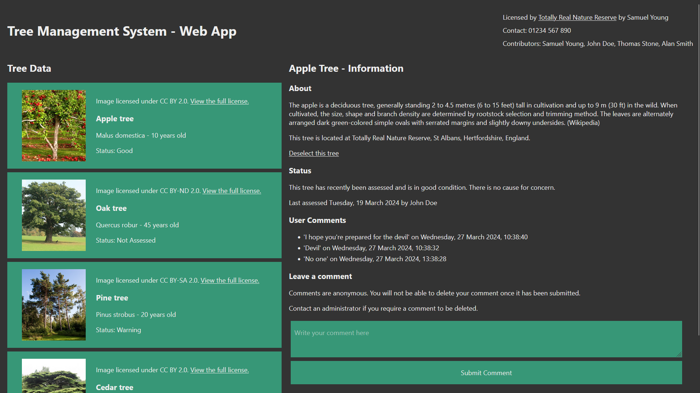

# Tree Management System

## Copyright Statement

This is a project done as part of my University of Hertfordshire Work-Based
Learning project, however, I, as the sole author of the project, retain full
copyright ownership.

At this stage of my university course, I'm currently doing undergraduate studies
at UH, therefore, since according to the university, "Undergraduate and taught
postgraduate students retain the copyright for work they create during the
course of their studies unless otherwise agreed with the University", UH retain
no copyright over this project.

For more information, please refer to the [Ask Herts page on the topic.](https://ask.herts.ac.uk/copyright#Owns)

## About



This is a client-server web application that enables administrators to supply,
update and report on trees in a specific nature reserve, and allows members of
the public to make anonymous comments on these trees.

As this is a client-server application with a separate client application, and
a separate server, this application cannot be hosted on GitHub Pages. Please
clone or download the repository and follow [Getting Started](#getting-started).

## Getting Started

You need `npm` and `node` to run this project. You can install them from the
Node.js website, available [here](https://nodejs.org/en/download/).

### Server

To run the server, navigate to the `server` directory and run

```bash
npm start
```

in your terminal to start the server on port 3001. Updating the JSON in the
`data` folder will automatically update the server. If it does not, run the `rs`
command.

### Client

To run the client, navigate to the `app` directory and run

```bash
npm start
```

to run the Node server and open the web client in your default browser, the
app connecting to the localhost server at port 3001.
